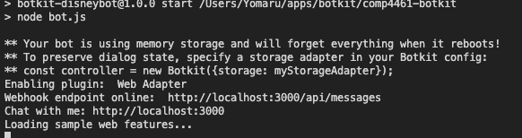

<p align="center">
    </a>
    <br />
</p>


# COMP4461 project 2 - ChatBot working prototype 

This is a chatbot for theme park. It provides interactive dialogs to users to answers their questions as well as improve their customer experience. Ideally, users can choose different characters as the personality of the chatbot. In this prototype, we use Disney as the context and Olaf as the personality. 


# how to start 

1. install npm and [node](https://nodejs.org/en/)
2. open terminal 
3. run command `npm install -g yo generator-botkit`
4. make an empty directory and cd into directory 
5. run command `git clone https://github.com/HananoshikaYomaru/comp4461-botkit.git`
6. run command `npm install`
7. to start, run command `npm run start`, then server will be set up in `http://localhost:3000`




# how to update 
1. run command `git pull https://github.com/HananoshikaYomaru/comp4461-botkit.git master`

# current support features 
1. attractions / games (where , queue , waiting time)
2. first aid (where)
3. smoking area (where, how many)
4. atm 
5. first aid / medical  
6. toliet / restroom 
7. water 

# How to embed 

include this piece of code in your html : 

```html 
<div id="embedded_messenger">
    <header id="message_hear" onclick="Botkit.toggle()">Chat</header>
    <iframe id="botkit_client" src="//{base_url}/index.html"></iframe>
</div>
<script src="//{base_url}/client.js"></script>
<script>
    var options= {} ;  
    Botkit.boot(options) ; 
</script> 
<link rel="stylesheet" href="//{base_url}/css/embed.css" />
```

# Botkit Starter Kit

This is a Botkit starter kit for web, created with the [Yeoman generator](https://github.com/howdyai/botkit/tree/master/packages/generator-botkit#readme).

To complete the configuration of this bot, make sure to update the included `.env` file with your platform tokens and credentials.

[Botkit Docs](https://botkit.ai/docs/v4)

This bot is powered by [a folder full of modules](https://botkit.ai/docs/v4/core.html#organize-your-bot-code). 
Edit the samples, and add your own in the [features/](features/) folder.